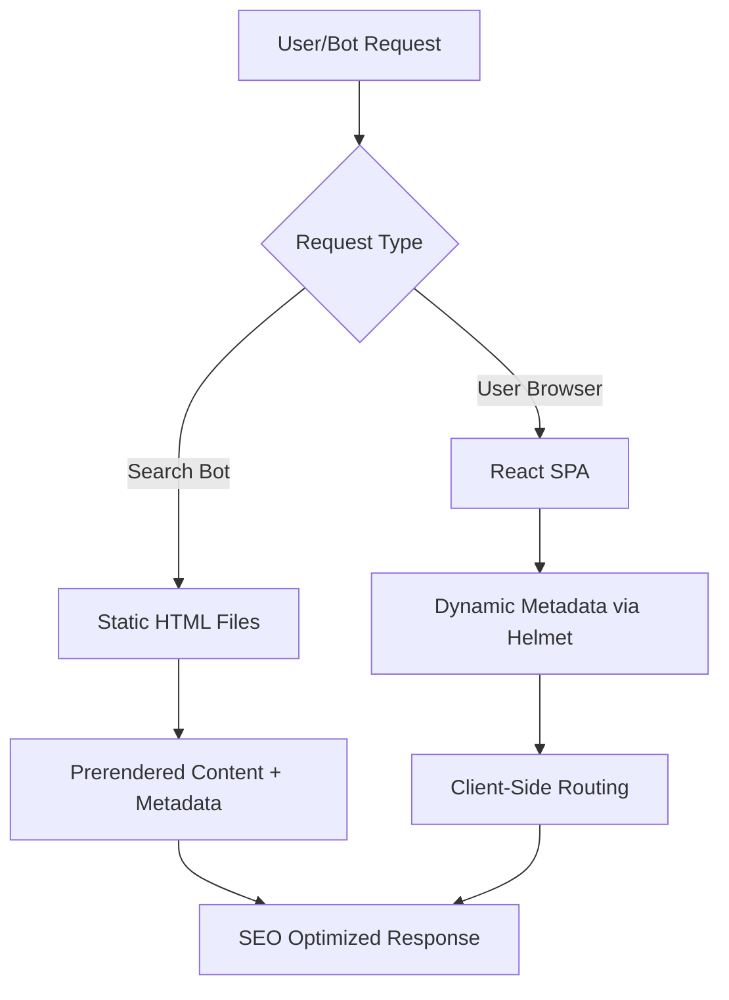

# SEO Optimization Design Document

## Overview

This design document outlines the implementation of SEO optimization for the Jabaki React SPA. The solution addresses the core challenge of making dynamic React content accessible to search engine crawlers while maintaining the existing user experience. The approach combines dynamic metadata management, static HTML generation, and proper URL structure to ensure all three studio pages (Red, Green, Garden) are properly indexed by search engines.

## Architecture

The SEO optimization follows a multi-layered approach:

1. **Metadata Layer**: Dynamic head management using react-helmet-async
2. **Prerendering Layer**: Static HTML generation for search engine crawlers
3. **Routing Layer**: Enhanced React Router configuration with SEO-friendly URLs
4. **Sitemap Layer**: Automated sitemap generation for search engine discovery



## Components and Interfaces

### MetadataManager Component

Responsible for managing dynamic metadata for each studio page.

```typescript
interface StudioMetadata {
  title: string;
  description: string;
  canonical: string;
  keywords: string[];
}

interface MetadataManagerProps {
  studio: "red" | "green" | "garden";
}
```

### PrerenderingService

Handles the generation of static HTML files during build process.

```typescript
interface PrerenderConfig {
  routes: string[];
  outputDir: string;
  staticDir: string;
}

interface PrerenderingService {
  generateStaticFiles(config: PrerenderConfig): Promise<void>;
  validateOutput(outputPath: string): boolean;
}
```

### SitemapGenerator

Generates XML sitemap for search engine discovery.

```typescript
interface SitemapEntry {
  url: string;
  lastmod: string;
  priority: number;
  changefreq: "daily" | "weekly" | "monthly";
}

interface SitemapGenerator {
  generateSitemap(entries: SitemapEntry[]): string;
  writeSitemapFile(content: string, outputPath: string): void;
}
```

## Data Models

### Studio Configuration

```typescript
interface StudioConfig {
  id: "red" | "green" | "garden";
  name: string;
  route: string;
  metadata: {
    title: string;
    description: string;
    keywords: string[];
    features: string[];
  };
  seo: {
    priority: number;
    changefreq: "daily" | "weekly" | "monthly";
  };
}
```

### SEO Configuration

```typescript
interface SEOConfig {
  baseUrl: string;
  studios: StudioConfig[];
  sitemap: {
    outputPath: string;
    includeLastmod: boolean;
  };
  prerender: {
    enabled: boolean;
    outputDir: string;
    routes: string[];
  };
}
```

## Correctness Properties

_A property is a characteristic or behavior that should hold true across all valid executions of a system-essentially, a formal statement about what the system should do. Properties serve as the bridge between human-readable specifications and machine-verifiable correctness guarantees._

### Property Reflection

After analyzing all acceptance criteria, several properties can be consolidated to eliminate redundancy:

- Properties about canonical tags (4.1 and 4.2) can be combined into one comprehensive canonical validation property
- Properties about static HTML generation (2.2 and 2.5) can be merged into a single build output property
- Properties about sitemap content (5.2 and 5.3) can be consolidated into one sitemap validation property

### Core Properties

**Property 1: Unique metadata per studio**
_For any_ studio page (red, green, garden), the page title and meta description should be unique and contain studio-specific content
**Validates: Requirements 1.1, 1.5**

**Property 2: Static HTML generation completeness**
_For any_ build process execution, static HTML files should be generated for all studio routes and contain all critical content including metadata and page text
**Validates: Requirements 2.2, 2.5**

**Property 3: Content consistency between static and dynamic**
_For any_ studio page, the content served to search engine bots should be identical to what users see after JavaScript execution
**Validates: Requirements 2.1, 2.3**

**Property 4: Canonical URL correctness**
_For any_ studio page, the canonical link tag should exist in the HTML head and point to the same URL as the current page
**Validates: Requirements 3.4, 4.1, 4.2**

**Property 5: Sitemap completeness and validity**
_For any_ build process, the generated sitemap.xml should contain all studio URLs with proper lastmod dates, priority values, and valid XML format compliant with sitemap protocol standards
**Validates: Requirements 5.1, 5.2, 5.3, 5.5**

**Property 6: SPA navigation preservation**
_For any_ navigation between studio pages, the system should maintain SPA behavior without full page reloads while updating document head content dynamically
**Validates: Requirements 6.1, 6.2, 6.3**

**Property 7: Dual build output generation**
_For any_ application build, both SPA bundle files and static HTML files should be generated successfully
**Validates: Requirements 6.5**

## Error Handling

### Metadata Loading Failures

- Fallback to default metadata if studio-specific metadata fails to load
- Log errors for debugging while maintaining user experience
- Graceful degradation when react-helmet-async encounters issues

### Prerendering Failures

- Fallback to client-side rendering if static HTML generation fails
- Build process should not fail completely if prerendering encounters errors
- Warning logs for failed routes during build process

### Sitemap Generation Errors

- Continue build process even if sitemap generation fails
- Log detailed error information for debugging
- Provide manual sitemap template as fallback

### Route Resolution Issues

- 404 handling for invalid studio routes
- Redirect handling for legacy URLs
- Proper error boundaries for React components

## Testing Strategy

### Dual Testing Approach

The SEO optimization requires both unit testing and property-based testing to ensure comprehensive coverage:

- **Unit tests** verify specific examples, edge cases, and error conditions
- **Property tests** verify universal properties that should hold across all inputs
- Together they provide comprehensive coverage: unit tests catch concrete bugs, property tests verify general correctness

### Unit Testing Requirements

Unit tests will cover:

- Specific metadata content for each studio (exact title and description matching)
- Individual route functionality (/red-studio, /green-studio, /garden-studio)
- Error handling scenarios (failed prerendering, missing metadata)
- Integration points between React Router and metadata management

### Property-Based Testing Requirements

Property-based testing will use **fast-check** library for JavaScript/TypeScript and run a minimum of 100 iterations per test. Each property-based test will be tagged with comments referencing the design document property using the format: **Feature: seo-optimization, Property {number}: {property_text}**

Property tests will verify:

- Metadata uniqueness across all studio combinations
- Static HTML generation consistency across different build configurations
- Canonical URL correctness for any valid studio route
- Sitemap validity across different studio configurations
- Navigation behavior preservation across all route transitions

### Test Configuration

- Minimum 100 iterations for each property-based test
- Each property-based test implements exactly one correctness property from this design
- Unit tests focus on specific examples rather than broad input ranges
- Integration tests verify end-to-end SEO functionality

## Implementation Notes

### Technology Stack

- **react-helmet-async**: For dynamic metadata management
- **vite-plugin-prerender** or **react-snap**: For static HTML generation
- **react-router-dom**: Enhanced with SEO-friendly configuration
- **fast-check**: Property-based testing library

### Build Process Integration

The SEO optimization integrates into the existing Vite build process:

1. Standard React build creates SPA bundle
2. Prerendering plugin generates static HTML for each studio route
3. Sitemap generator creates sitemap.xml during build
4. Both outputs are deployed together

### Performance Considerations

- Static HTML files are served to bots, SPA to users
- Metadata updates happen client-side without performance impact
- Prerendering adds to build time but not runtime performance
- Sitemap generation is a one-time build step
